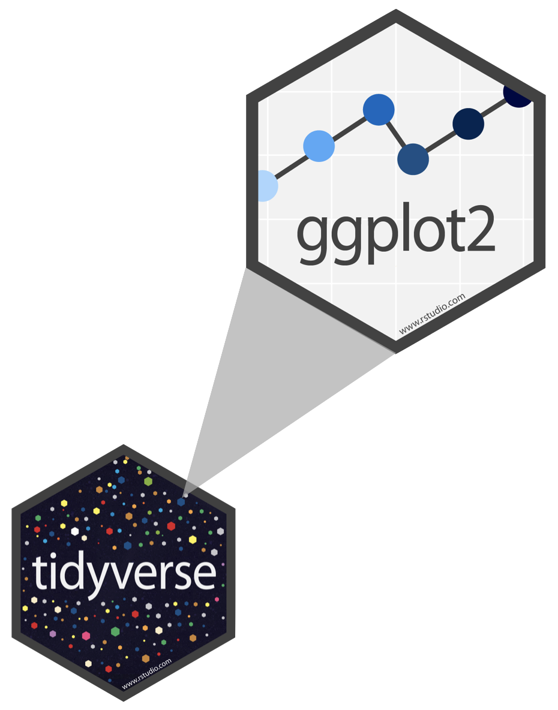
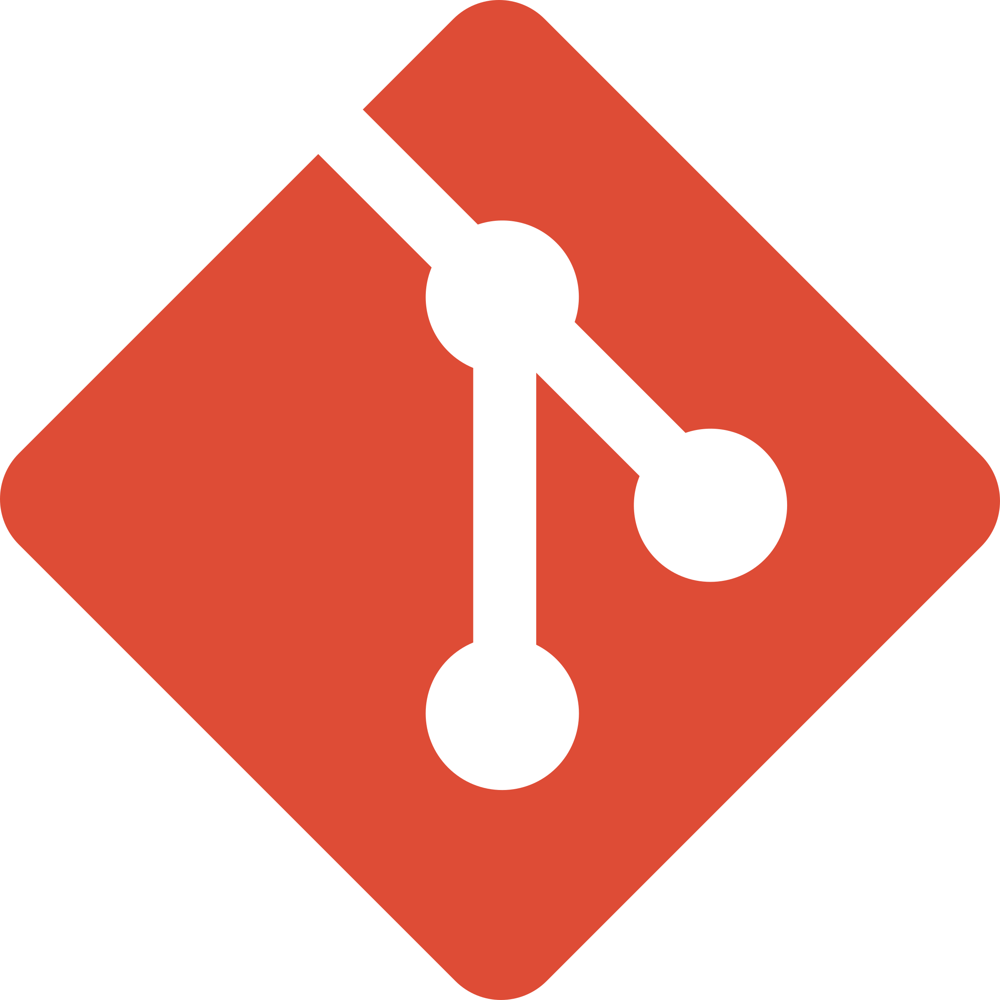

# Course Details

## Teaching team

:::: columns
::: {.column width="50%"}
### Instructor

Dr. Greg Chism

Office: Online via Zoom

[gchism\@arizona.edu](mailto:gchism@arizona.edu)
:::
::::

## Timetable

-   Lectures (weekly)
    -   Online (asynchronous)
-   Course dates
    -   On D2L

## Themes: what, why, and how {.smaller}

-   **What:** the plot
    -   Specific types of visualizations for a particular purpose (e.g., maps for spatial data, Sankey diagrams for proportions, etc.)
    -   Tooling to produce them (e.g., specific R packages)

. . .

-   **How:** the process
    -   Start with a design (sketch + pseudo code)
    -   Pre-process data (e.g., wrangle, reshape, join, etc.)
    -   Map data to aesthetics
    -   Make visual encoding decisions t(e.g., address accessibility concerns)
    -   Post-process for visual appeal and annotation

. . .

-   **Why:** the theory
    -   Tie together "how" and "what" through the grammar of graphics

# Course components

## Lectures {.smaller}

-   Asynchronous online (recorded)

-   Content:

    -   Traditional lecture (mostly)

    -   Live coding + demos

## Announcements

-   Sent via Discord, be sure to check regularly

-   I'll assume that you've read an announcement by the next "business" day

## Diversity and inclusion {.smaller}

It is my intent that students from all diverse backgrounds and perspectives be well-served by this course, that students' learning needs be addressed both in and out of class, and that the diversity that the students bring to this class be viewed as a resource, strength and benefit.

-   If you have a name that differs from those that appear in your official UArizona records, please let me know!

-   Please let me know your preferred pronouns.

-   If you feel like your performance in the class is being impacted by your experiences outside of class, please don't hesitate to come and talk with me. I want to be a resource for you. If you prefer to speak with someone outside of the course, your advisers and deans are excellent resources.

-   I (like many people) am still in the process of learning about diverse perspectives and identities. If something was said in class (by anyone) that made you feel uncomfortable, please talk to me about it.

## Accessibility

-   The [Disability Resource Center](https://drc.arizona.edu/) is available to ensure that students are able to engage with their courses and related assignments.

-   I am committed to making all course materials accessible and I'm always learning how to do this better. If any course component is not accessible to you in any way, please don't hesitate to let me know.

# Assessments

## Reading quizzes (10%)

-   Online, individual
-   Cover reading that is due since the previous quiz and up to and including the deadline for the given quiz
-   Due by 5 pm AZ Time on the indicated day on the course schedule

## Homework assignments (50%)

-   Submitted on GitHub, individual
-   Due by 5 pm AZ Time on the indicated day on the course schedule

## Final Project (40%)

-   Submitted on GitHub, team-based (pairs)

-   Interim deadlines, peer review on content, peer evaluation for team contribution

-   Same/similar data, different results

-   Presentation and write-up

-   Wrapped up before final class date

##  {.smaller}

## Grading {.smaller}

This course is assessed 100% on your coursework (there is no exam). We will be assessing you based on the following assignments,

| Assignment | Type | Value | n | Due |
|:--------------|:--------------|:--------------|:--------------|---------------|
| Reading quizzes | Individual | 10% | 4 | \~ Every other week |
| Homework | Individual | 50% | 5 | \~ Every other week |
| Final Project | Individual | 40% | 1 | \~ Final week + earlier interim deadlines |

# Course policies

## Late work policy {.smaller}

-   Reading quizzes: Late submissions not accepted

-   Homework assignments:

    -   Late, but next day (before 5pm): -10% of available points
    -   Late, but next day (after 5pm): -20% of available points
    -   Two days late or later: No credit, and we will not provide written feedback

-   Project presentations: Late submissions not accepted

-   Peer evaluation:

    -   Late submissions not accepted
    -   Must turn in peer evaluation if you want your own score from others

## Sharing / reusing code policy

-   We are aware that a huge volume of code is available on the web, and many tasks may have solutions posted

-   Unless explicitly stated otherwise, this course's policy is that you may make use of any online resources (e.g. RStudio Community, StackOverflow, etc.) but you must explicitly cite where you obtained any code you directly use or use as inspiration in your solution(s).

-   Any recycled code that is discovered and is not explicitly cited will be treated as plagiarism, regardless of source

## ChatGPT / AI policy

-   We are additionally aware of the potential code AI for coding (your instructor taught a workshop on it...).

-   While these tools are amazing, learners should be aware of the impacts that using such tools can have on core competency. David Humphrey, a computer science professor, [**wrote about ChatGPT and its potentially negative impacts on core learning.**](https://blog.humphd.org/cheatgpt/) It is a good read about the pitfalls of using generative AI in an educational context.

-   By using a generative AI, learners may miss the opportunity to discover how something works and why things are done that way.

## Academic integrity

> To uphold the [UArizona iSchool Community Standard](https://ischool.arizona.edu/sites/ischool.arizona.edu/files/iSchool%20Policy%20on%20Academic%20Integrity%20in%20Computing%202023%20-%20approved%20by%20faculty%20vote%20April%202023.pdf#:~:text=UArizona%20iSchool%20Instructors%20are%20expected%20to%20help%20students,prohibited%20in%20some%20courses%20are%20allowed%20in%20others.):

> -   I will not lie, cheat, or steal in my academic endeavors;
> -   I will conduct myself honorably in all my endeavors; and
> -   I will act if the Standard is compromised.

## 

<br><br><br>

::: {.large .hand style="text-align: center"}
most importantly:

ask if you're not sure if something violates a policy!
:::

# Support

## Office hours {.smaller}

-   Greg:

    -   Tuesdays, 11am AZ time
    -   By appointment - Zoom

-   \+ lots more resources listed on the syllabus!

## Wellness

I want to make sure that you learn everything you were hoping to learn from this class. If this requires flexibility, please don't hesitate to ask.

-   You never owe me personal information about your health (mental or physical) but you're always welcome to talk to me. If I can't help, I likely know someone who can.

-   I want you to learn lots of things from this class, but I primarily want you to stay healthy, balanced, and grounded.

# Course Tools

## RStudio

::: {.large style="text-align: center;"}
<https://posit.cloud/>
:::

-   Browser based RStudio instance(s)

-   Requires internet connection to access

-   Provides consistency in hardware and software environments

-   Local R installations are fine but we will not guarantee support

## GitHub Classroom {.smaller}

-   All of your work and your membership (enrollment) in the classroom is private

-   Each assignment is a private repo on GitHub, I distribute the assignments on GitHub and you submit them there

-   Feedback on assignments is given as GitHub issues, scores recorded on D2L Grade book

::: task
Accept the HW-00 Assignment to link your GitHub Username with your roster name.
:::

## Username advice {.smaller}

::: hand
in case you don't yet have a GitHub account...
:::

Some brief advice about selecting your account names (particularly for GitHub),

-   Incorporate your actual name! People like to know who they're dealing with and makes your username easier for people to guess or remember

-   Reuse your username from other contexts, e.g., Twitter or Discord

-   Pick a username you will be comfortable revealing to your future boss

-   Shorter is better than longer, but be as unique as possible

-   Make it timeless. Avoid highlighting your current university, employer, or place of residence

## Discord {.smaller}

-   Online forum for asking and answering questions

-   Private server for course organization

-   You will need to join the server for access

-   Ask **and answer** questions related to course logistics, assignment, etc. here

-   Personal questions (e.g., extensions, illnesses, etc.) should be via email to me

-   Once you join, browse the channels to make sure you're posting questions in the right channel, update your profile with your name, photo/avatar of you that matches your GitHub profile, and your pronouns

-   **Unfortunately** Discord is **not** the best place to ask coding questions, but it's a great place for real-time connection and collaboration

## Before the weekend (Week 1)

1.  Create a GitHub account if you don't have one

2.  Read the syllabus

3.  Make sure you can log in to RStudio Cloud

4.  Accept and complete HW-00

# Grammar of graphics

## Data visualization

> *"The simple graph has brought more information to the data analyst's mind than any other device." --- John Tukey*

-   Data visualization is the creation and study of the visual representation of data

-   Many tools for visualizing data -- R is one of them

-   Many approaches/systems within R for making data visualizations -- **ggplot2** is one of them, and that's what we're going to use

## ggplot2 ∈ tidyverse

::::: columns
::: {.column width="50%"}
{fig-align="left"}
:::

::: {.column width="50%"}
-   **ggplot2** is tidyverse's data visualization package

-   `gg` in "ggplot2" stands for Grammar of Graphics

-   Inspired by the book **Grammar of Graphics** by Leland Wilkinson
:::
:::::

## Grammar of Graphics

::::: columns
::: {.column width="30%"}
A grammar of graphics is a tool that enables us to concisely describe the components of a graphic
:::

::: {.column width="70%"}
{fig-align="right"}
:::
:::::

::: aside
Source: [BloggoType](http://bloggotype.blogspot.com/2016/08/holiday-notes2-grammar-of-graphics.html)
:::

## Hello ggplot2!

-   `ggplot()` is the main function in ggplot2
-   Plots are constructed in layers
-   Structure of the code for plots can be summarized as

```{r}
#| eval: false

ggplot(data = [dataset], 
       mapping = aes(x = [x-variable], y = [y-variable])) +
   geom_xxx() +
   other options
```

-   The ggplot2 package comes with the tidyverse

```{r}
#| message: false

library(tidyverse)
```

-   For help with ggplot2, see [ggplot2.tidyverse.org](http://ggplot2.tidyverse.org/)

# Quarto

# What is Quarto?

## Quarto ...

-   is a new, open-source, scientific, and technical publishing system.

{fig-alt="A schematic representing the multi-language input (e.g. Python, R, Observable, Julia) and multi-format output (e.g. PDF, html, Word documents, and more) versatility of Quarto." fig-align="center"}

## Quarto

With Quarto you can weave together narrative text and code to produce elegantly formatted output as documents, web pages, blog posts, books and more.

. . .

<br>

*just like R Markdown...*

. . .

<br>

but not *just like* it, there's more to it...

## Quarto unifies + extends R Markdown

::: incremental
-   Consistent implementation of attractive and handy features across outputs: tabsets, code-folding, syntax highlighting, etc.
-   More accessible defaults as well as better support for accessibility
-   Support for other languages like Python, Julia, Observable, and more via Jupyter engine for executable code chunks.
:::

## Git + GitHub

::::::: columns
:::: {.column width="50%"}
{fig-align="center" width="150"}

::: incremental
-   **Version Control System**

-   **Local and Remote Repositories**

-   **Branching and Merging**
:::
::::

:::: {.column width="50%"}
{fig-align="center" width="250"}

::: incremental
-   **Code Hosting Platform**

-   **Open Source and Private Projects**

-   **Community and Networking**
:::
::::
:::::::
